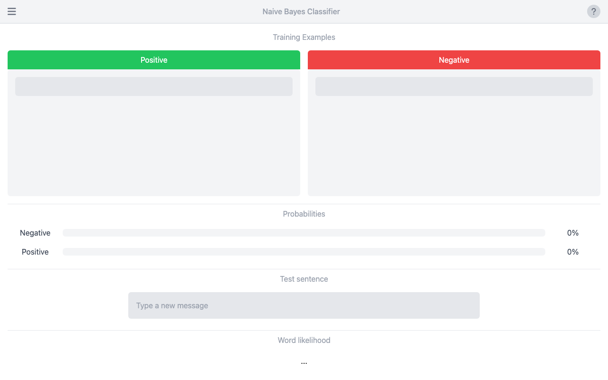

# 📬 Naive-Bayes-Classifier (Spam Classifier)

A Vue 3 app that classifies text as spam or not using a Naive Bayes classifier implemented from scratch.



## Features

- 🧮 **Naive Bayes from scratch** — classification logic lives in `src/JS/SpamClassifier.js`, no ML library dependency
- 📝 **Interactive input** — type or paste text and get a live spam/ham classification
- 📐 **Math rendering** — uses `mathjax-vue3` to display the underlying probability formulas
- 📱 **Installable** — configured as a PWA via `vite-plugin-pwa`

## Installation

```bash
git clone <this repo>
cd Naive-Bayes-Classifier
npm install
```

## Usage

```bash
npm run dev
```

Then open the printed local URL (default Vite port, typically [http://localhost:5173](http://localhost:5173)).

## Built with

- [Vue 3](https://vuejs.org/) + [Vite](https://vitejs.dev/)
- [Tailwind CSS](https://tailwindcss.com/)
- [MathJax](https://www.mathjax.org/) (via mathjax-vue3)
- Font Awesome / Heroicons

## Status

🧪 Educational demo — a single hand-rolled classifier intended to illustrate how Naive Bayes works, not a production spam filter.

✅ Runs cleanly — `npm install && npm run build` verified working as of 2026-09-03 (Vite + PWA build succeeds with no errors).
